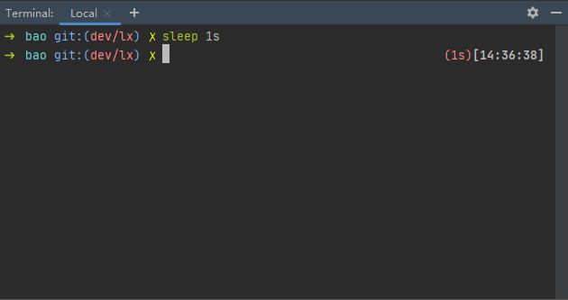

# robbyrussell.zsh-theme
oh-my-zsh默认主题robbyrussell添加执行时间版

## Screenshot



## Usage

```sh
wget -O ~/.oh-my-zsh/themes/robbyrussell.zsh-theme https://raw.githubusercontent.com/whoisix/robbyrussell.zsh-theme/master/robbyrussell.zsh-theme
```

